<!-- PROJECT LOGO -->
<br />
<p align="center">
  <a href="https://github.com/BudiSetyo/warung4.0">
    
  </a>

  <h3 align="center">Warung 4.0</h3>

  <p align="center">
    This is a simple application with the concept of a trending food sale. 
    <br />
    <a href="https://warung4-0.vercel.app/">View Deployed App</a>
    <br />
  </p>
</p>

<!-- TABLE OF CONTENTS -->
<details open="open">
  <summary><h2 style="display: inline-block">Contents</h2></summary>
  <ol>
    <li>
      <a href="#about-the-project">About The Project</a>
      <ul>
        <li><a href="#built-with">Built With</a></li>
      </ul>
    </li>
    <li>
      <a href="#getting-started">Getting Started</a>
      <ul>
        <li><a href="#installation">Installation</a></li>
      </ul>
    </li>
    <li><a href="#usage">Usage</a></li>
    <li><a href="#screenshots">Screenshots</a></li>

  </ol>
</details>

<!-- ABOUT THE PROJECT -->

## About The Project

This is a simple application with the concept of a trending food sale.

### Built With

- [Node Js v14.19.1 or Latest](https://nodejs.org/)
- [Javascript](https://www.w3schools.com/js/DEFAULT.asp)
- [React Js](https://reactjs.org/)
- [Next Js](https://nextjs.org/)
- [Redux](https://redux.js.org/)
- [Chakra UI](https://chakra-ui.com/)
- [Tailwind CSS](https://tailwindcss.com/)

<!-- GETTING STARTED -->

### Installation

1. Install Node Js

    <div align="center">
     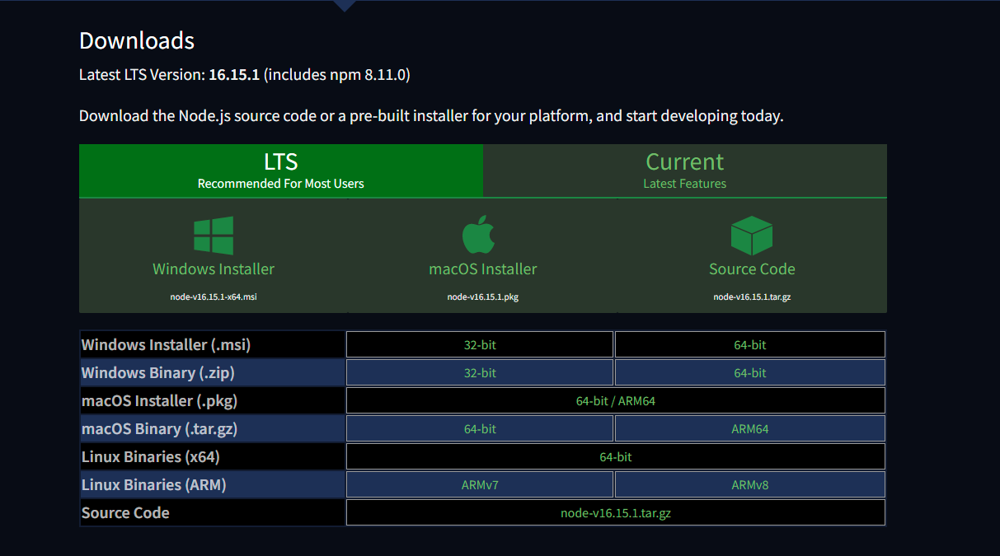   
    </div>

   ```
   Install for windows latest version
   ```

   <div align="center">
     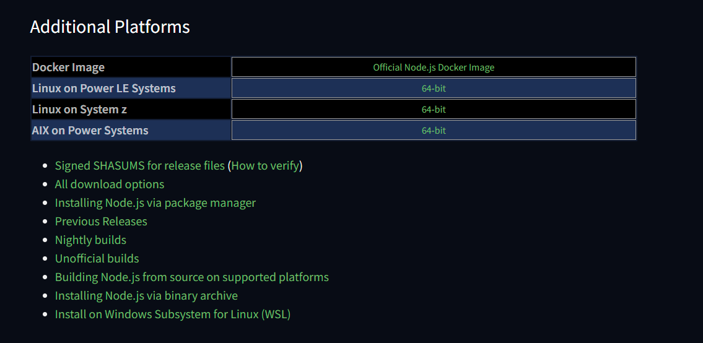   
   </div>

   <div align="center">
     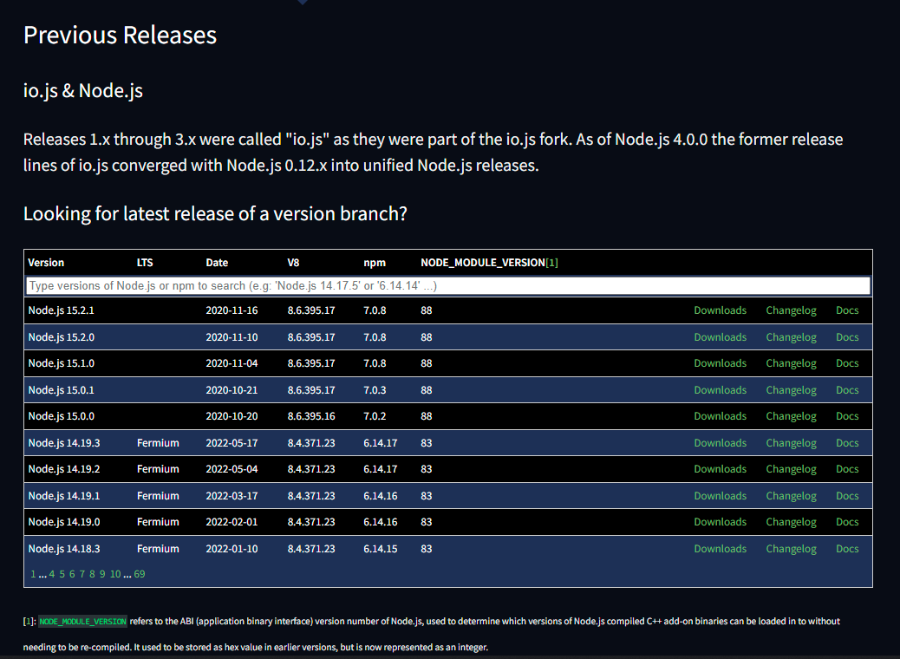   
   </div>

   ```
   Install for windows previous version
   ```

   <div align="center">
     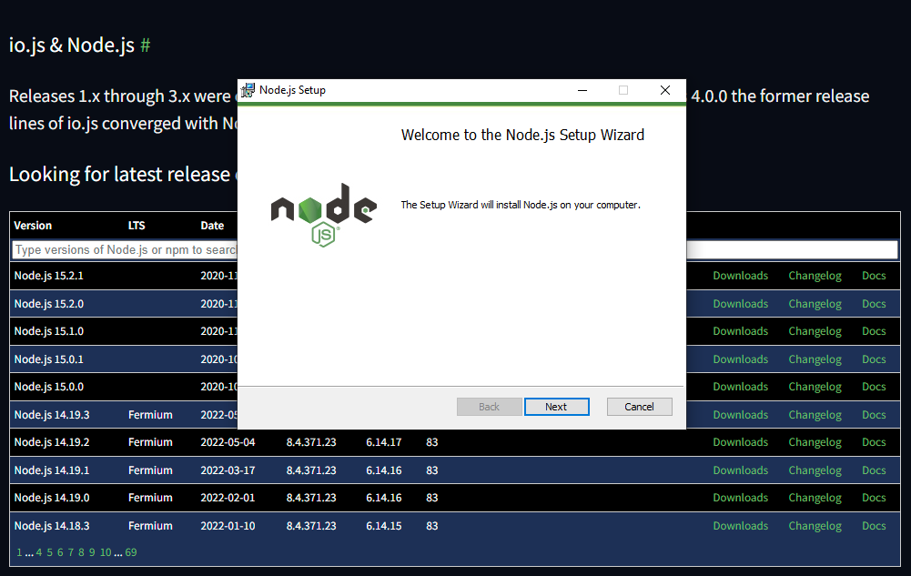   
   </div>

   ```
   Install Node Js
   ```

2. Install yarn

   <div align="center">
     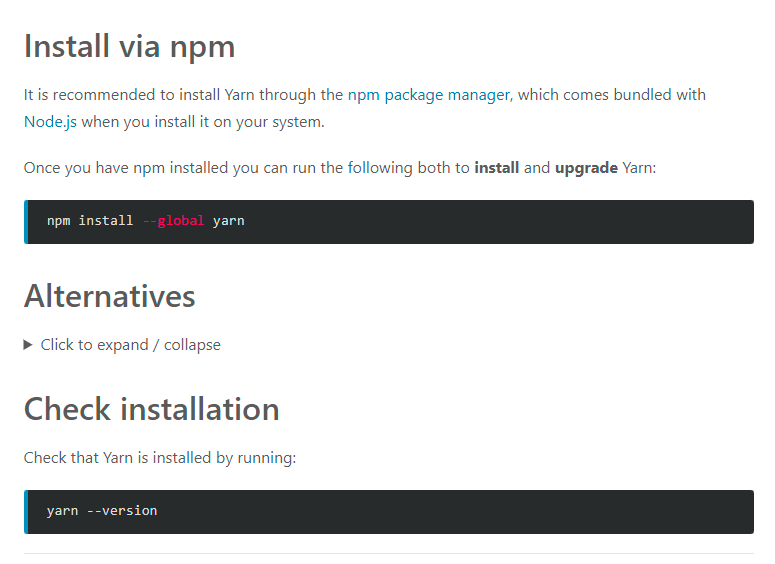   
   </div>

   ```
   install global yarn with "npm install --global yarn" and check version "yarn --version"
   ```

3. Clone the repo

   <div align="center">
     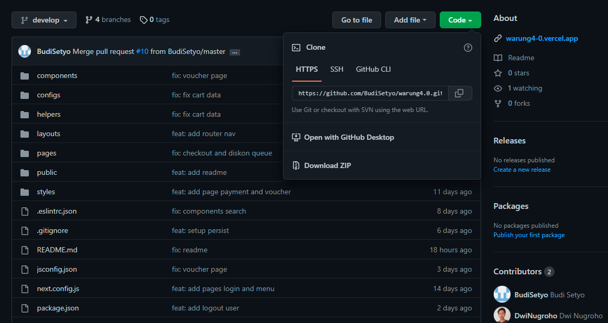   
   </div>

   ```
   git clone https://github.com/BudiSetyo/warung4.0.git
   ```

4. Open the folder

5. Install dependencies

   ```
   yarn install
   ```

6. Run the App

   ```
    yarn dev
   ```

### Screenshots

<div align="center">
    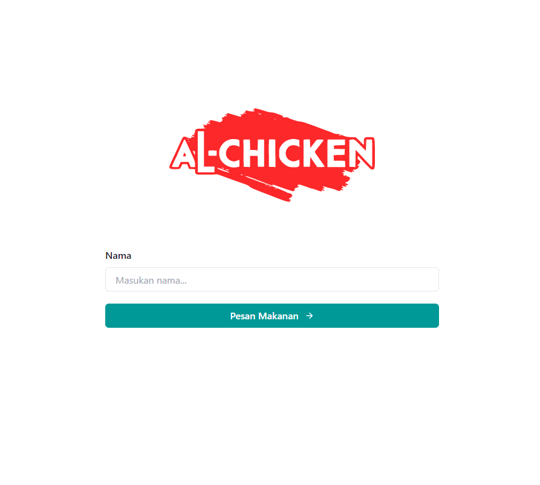   
</div>
<div align="center">
    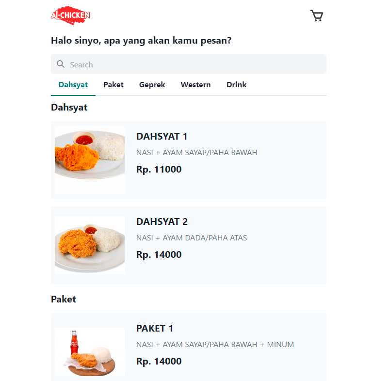   
</div>
<div align="center">
    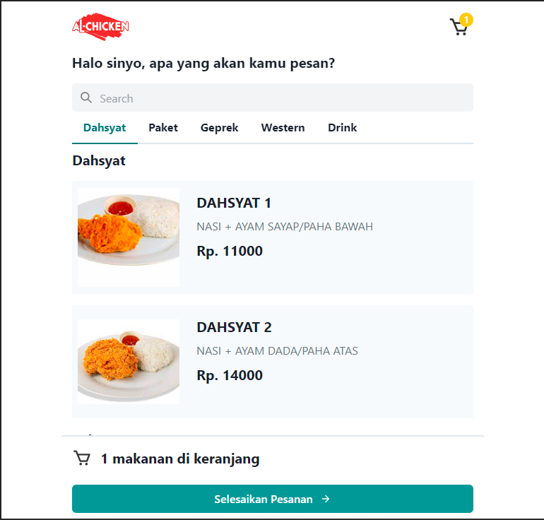   
</div>
<div align="center">
    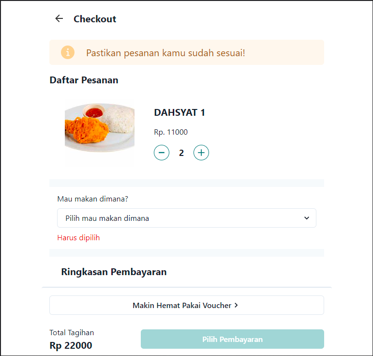   
</div>
<div align="center">
    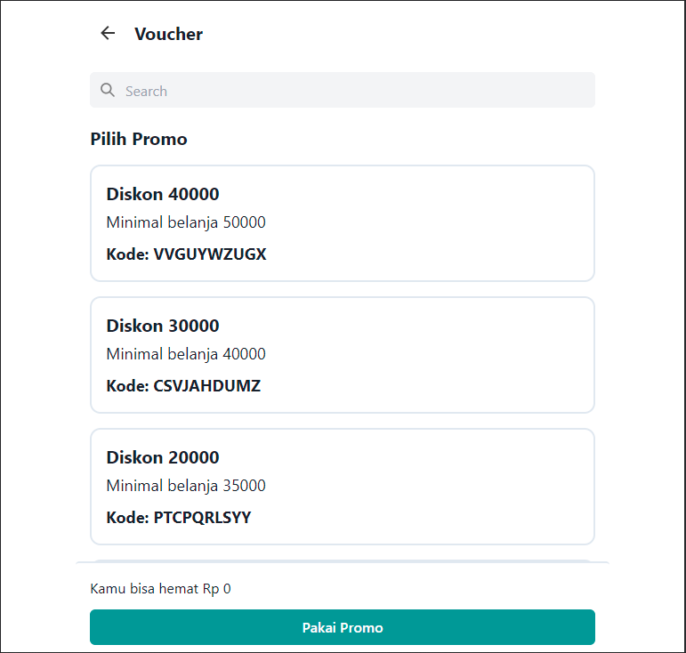   
</div>
<div align="center">
    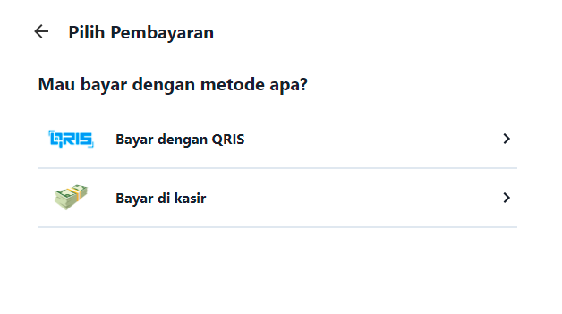   
</div>
<div align="center">
    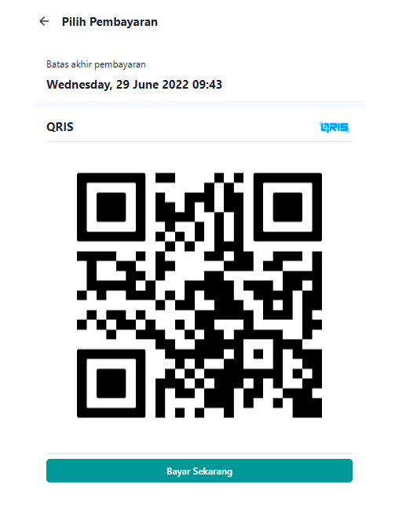 
</div>
<div align="center">
    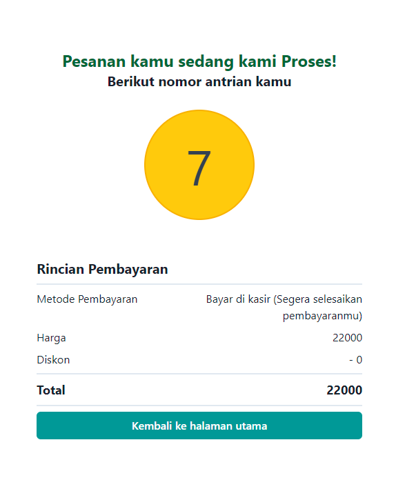   
</div>
